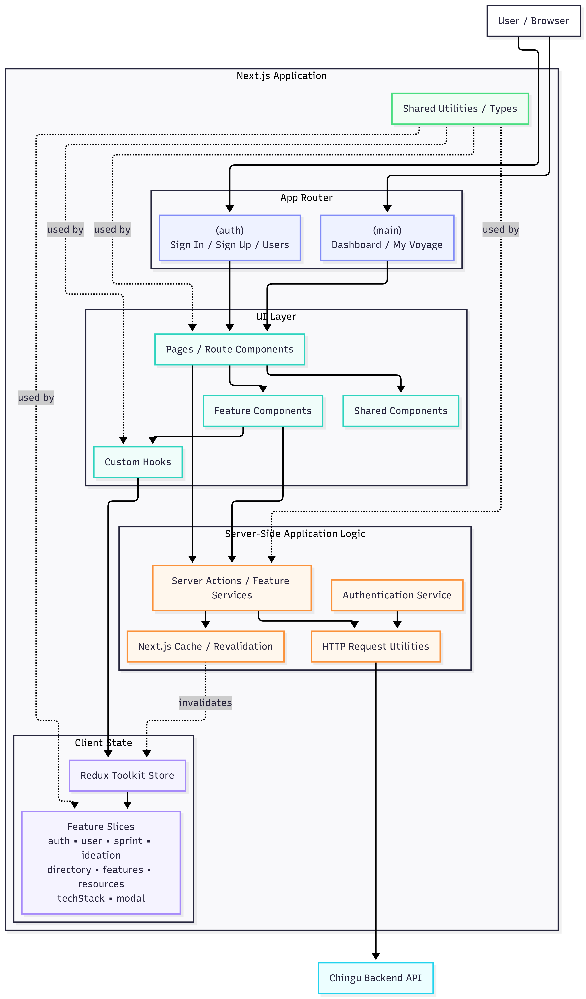

The application is organized around Next.js App Router routes and feature-oriented UI components. Pages compose feature-specific components and shared components, with custom hooks providing access to client-side state managed through Redux Toolkit.

Backend interactions are handled through server-side actions and services, which centralize communication with the Chingu API. This separates UI concerns from backend integration while providing a consistent boundary for data access and server-side operations.

Shared utilities and types are reused across the application to keep common functionality consistent between features.
